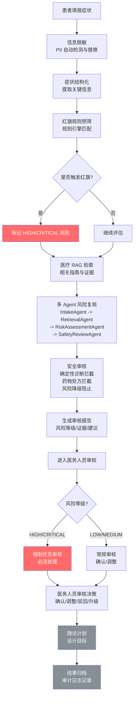

# 核心业务流程图

## 说明

- **所有 AI 结果均进入医务人员审核**，不跳过人工审核环节
- **HIGH/CRITICAL** 风险标记为强制优先审核，必须处理
- **LOW/MEDIUM** 风险为常规审核，同样必须经过审核
- **随访计划**和**结果归档**标记为设计目标（虚线样式）
- **红旗规则预筛**由确定性规则引擎执行，不依赖 AI 模型
- **风险降级阻止**：HIGH/CRITICAL 风险不允许被模型下调
