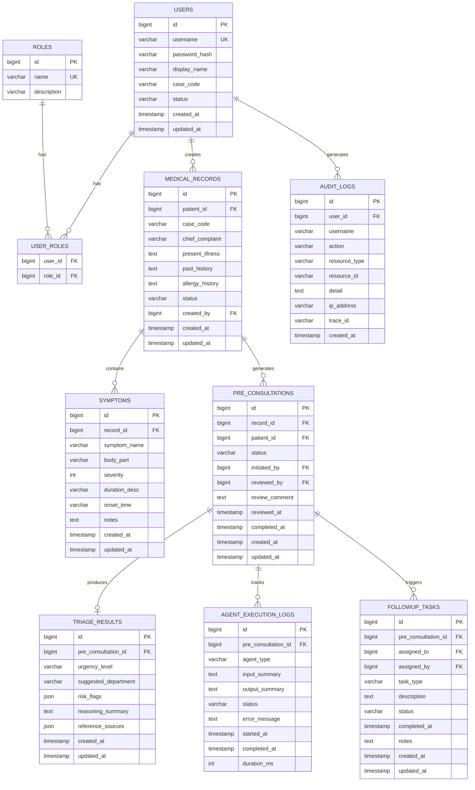
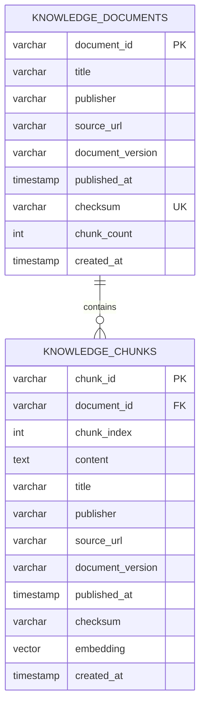

# 数据库 ER 图

本图分为三个部分：

1. **PR #10 当前拟合并物理模型** — 待 PR #10 审核合并，字段以 PR #10 Entity 为准
2. **AI pgvector 已实现模型** — ai-service 中 migrations/001_pgvector.sql 定义的知识库表
3. **后续设计目标模型** — 尚未实现，以注释形式保留

> **注意**：PR #10 当前物理模型标注为待审核合并，最终以合并版本为准。

## PR #10 当前拟合并物理模型

## AI pgvector 已实现模型

## 后续设计目标模型（尚未实现）

以下表为设计目标，尚未在任何代码中实现：

- **SIMULATED_PATIENTS** — 合成患者档案管理（独立于 MEDICAL_RECORDS）
- **VISITS** — 就诊记录管理
- **AGENT_RUNS** — Agent 执行记录（独立于 AGENT_EXECUTION_LOGS 的扩展设计）
- **CITATIONS** — 知识引用记录（独立关联检索结果）
- **FOLLOWUP_PLANS** — 随访计划管理（FOLLOWUP_TASKS 的上层计划实体）

> 这些表的具体字段和关联关系需在后续开发中根据实际需求确定。
