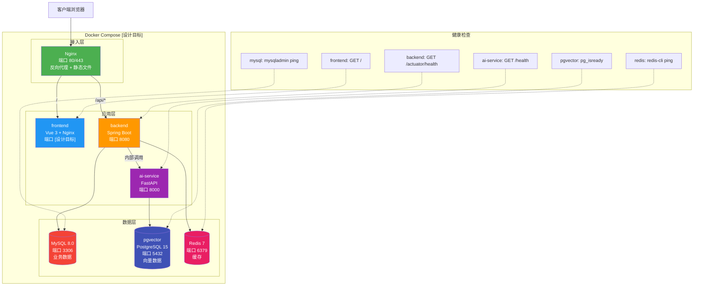

# Docker 部署图

## 说明

- **Docker Compose 整体为设计目标**，当前仅 AI 服务 Dockerfile 已就绪
- **Nginx 统一入口**：前端只调用后端，后端通过内部调用连接 AI 服务
- **AI 服务只连接 pgvector**，不直接连接 MySQL
- **健康检查**：每个服务有对应的健康检查端点，虚线连接到对应服务
- **设计目标容器**：Nginx、frontend（端口待定）、backend、MySQL、Redis
- **pgvector 及 AI 服务**：迁移脚本及存储适配代码已实现，容器编排和真实联调仍为设计目标
