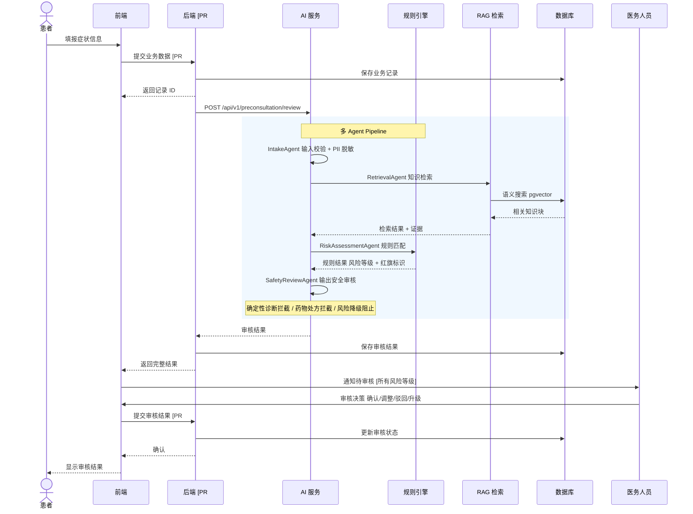

# 预问诊业务时序图

## 说明

- **调用链**：患者 -> 前端 -> 后端保存业务数据 -> 后端调用 AI -> AI 执行规则/RAG/多 Agent -> 后端保存结果 -> 医务人员审核
- **所有风险等级均进入医务人员审核**，HIGH/CRITICAL 为强制优先审核
- **不使用虚构接口路径**：后端接口用逻辑名称标注，注明"PR #10 待审核"
- **AI 已实现接口**：`POST /api/v1/preconsultation/review`
- **数据库操作**：pgvector 用于知识检索，业务数据保存待 PR #10 后端实现
