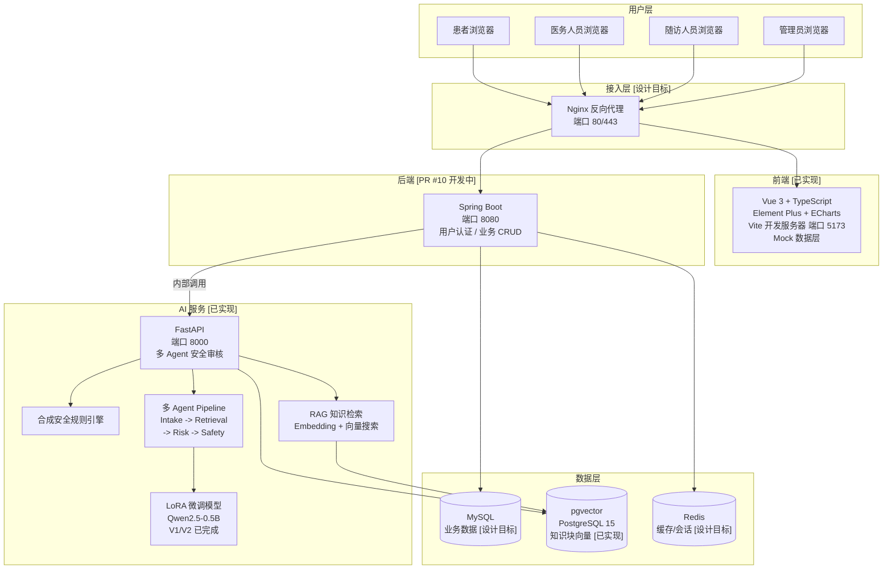

# 系统总体架构图

## 说明

- **目标调用链**：前端 -> Spring Boot 后端 -> FastAPI AI 服务
- **FastAPI 不直接向普通前端公开**，应通过 Spring Boot 后端代理调用
- **当前状态**：前端使用 Mock 数据和占位接口，尚未完成真实接口联调
- **设计目标节点**：Nginx、Redis、MySQL、随访人员浏览器
- **已实现节点**：Vue 前端（Mock 数据层）、FastAPI AI 服务、pgvector 向量存储、LoRA 微调
- **PR #10 待审核**：Spring Boot 后端接口最终以合并版本为准
